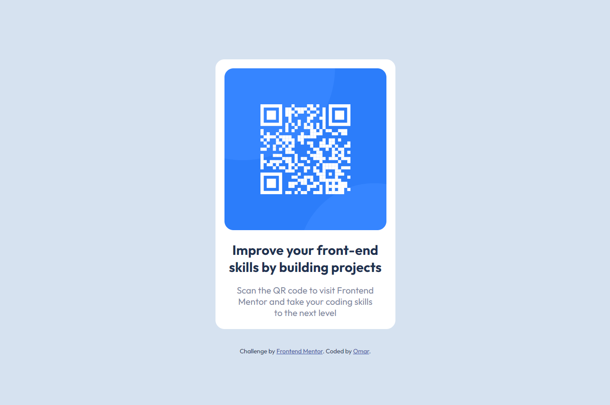

# Frontend Mentor - QR code component solution

This is a solution to the [QR code component challenge on Frontend Mentor](https://www.frontendmentor.io/challenges/qr-code-component-iux_sIO_H).

## Table of contents

- [Overview](#overview)
  - [Screenshot](#screenshot)
  - [Links](#links)
- [My process](#my-process)
  - [Built with](#built-with)
  - [What I learned](#what-i-learned)
- [Author](#author)

## Overview

### Screenshot

### Links

- Solution URL: [Github Repo](https://github.com/to-my-learning-path/qr-code-component-main)
- Live Site URL: [Github Pages](https://to-my-learning-path.github.io/qr-code-component-main)

## My process

### Built with

- Semantic HTML5 markup
- CSS custom properties
- Flexbox

### What I learned

I learned about CSS custom properties and :root pseudo-class

### Continued development

Implement SCSS

## Author

- Frontend Mentor - [@Omar](https://www.frontendmentor.io/profile/to-my-learning-path)
